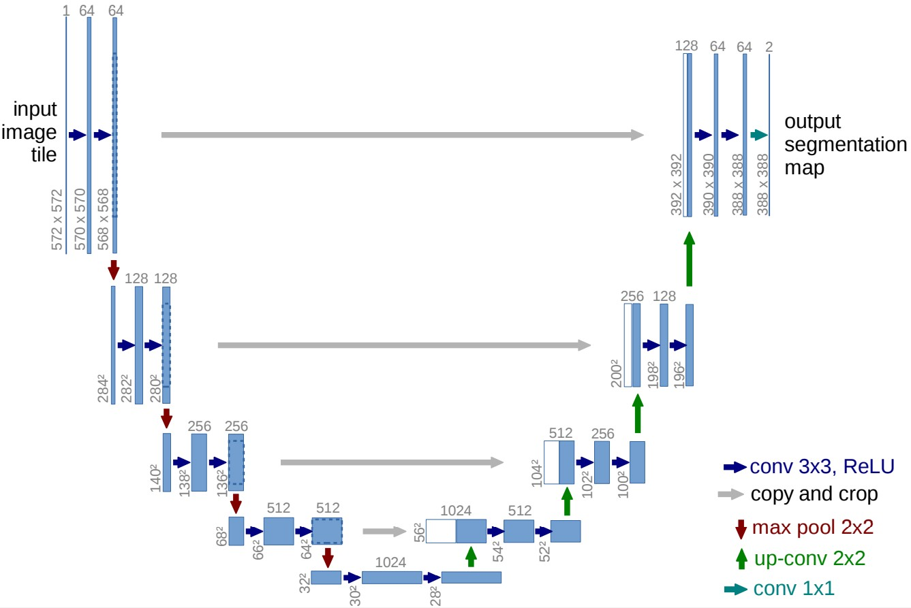

# Unet
this is an implemetion of Unet in Pytorch and it's architecture is as follows which is the same with paper of [Unet](https://arxiv.org/abs/1505.04597)

# component of Unet
## Convolution and downsampling
two layers of convolution which consists of BatchNorm and Relu and then downsampling
~~~python
class TwoConv(nn.Module):
    def __init__(self, in_channels, out_channels):
        super(TwoConv, self).__init__()
        self.twoconv = nn.Sequential(
            nn.Conv2d(in_channels, out_channels, kernel_size=3),
            nn.BatchNorm2d(out_channels),
            nn.ReLU(inplace=True),
            nn.Conv2d(out_channels, out_channels, kernel_size=3),
            nn.BatchNorm2d(out_channels),
            nn.ReLU(inplace=True),
        )

    def forward(self, x):
        return self.twoconv(x)

class TwoConvDown(nn.Module):
    def __init__(self, in_channels, out_channels):
        super(TwoConvDown, self).__init__()
        self.twoconvdown = nn.Sequential(
            nn.MaxPool2d(2),
            TwoConv(in_channels, out_channels),
        )

    def forward(self, x):
        return self.twoconvdown(x)
~~~

## Upsampling and Concatation

there are two modes, "pad" and "crop" to deal with  the different size of two parts in Unet. "crop" is the same operation with paper of Unet.
~~~python
class UpCat(nn.Module):
    def __init__(self, in_channels, out_channels):
        super(UpCat, self).__init__()
        self.up = nn.ConvTranspose2d(in_channels, in_channels // 2, kernel_size=2, stride=2)
        self.twoconv = TwoConv(in_channels=in_channels, out_channels=out_channels)

    def forward(self, x1, x2, mode="pad"):
        '''
        :param x1: Unet right part, size is samller
        :param x2: Unet left part，size is larger
        :return:
        '''
        x1 = self.up(x1)
        diffY = x2.size()[2] - x1.size()[2]
        diffX = x2.size()[3] - x1.size()[3]

        if mode == "pad":
            x1 = nn.functional.pad(x1, (diffX // 2, diffX - diffX // 2, diffY // 2, diffY - diffY // 2))
        elif mode == "crop":
            left = diffX // 2
            right = diffX - left
            up = diffY // 2
            down = diffY - up

            x2 = x2[:, :, left:x2.size()[2]-right, up:x2.size()[3]-down]

        x = torch.cat([x2, x1], dim=1)
        x = self.twoconv(x)
        return x
~~~

## main part of Unet
~~~python
class Unet(nn.Module):
    def __init__(self, in_channels,
                 channel_list: list = [64, 128, 256, 512, 1024],
                 length = 5,
                 mode = "pad")
~~~
